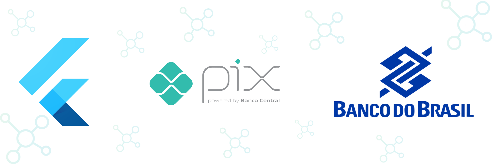

<a name="readme-top"></a>


<h1 align="center">Pix BB - Easy to use interface for integrating with Banco do Brasil's Pix API in your Flutter Apps.</h1>

<!-- PROJECT LOGO -->
<br />
<div align="center">
  <a href="https://pub.dev/packages/pix_bb">
    
  </a>

  <p align="center">
    This package offers an easy-to-use interface for integrating with Banco do Brasil's Pix API. With this package, you can get transaction information quickly and efficiently in your Flutter apps.
    <br />
    <a href="https://pub.dev/documentation/pix_bb/latest/"><strong>Explore the docs »</strong></a>
    <br />
    <br />
    <!-- <a href="https://github.com/othneildrew/Best-README-Template">View Demo</a> -->
    <!-- · -->
    <a href="https://github.com/AcxTechSistemas/pix_bb/issues">Report Bug</a>
    ·
    <a href="https://github.com/AcxTechSistemas/pix_bb/issues">Request Feature</a>
  </p>

<br>

<!--  SHIELDS  ---->

[](https://github.com/AcxTechSistemas/pix_bb/blob/main/LICENSE)
[](https://pub.dev/packages/pix_bb/score)
[](https://github.com/AcxTechSistemas/pix_bb/graphs/contributors)
[](https://github.com/AcxTechSistemas/pix_bb/graphs/contributors)

[](https://pub.dev/publishers/acxtech.com.br/packages)
</div>
<br>

<!-- TABLE OF CONTENTS -->
<details>
  <summary>Table of Contents</summary>
  <ol>
    <li><a href="#about-the-project">About The Project</a></li>
    <li><a href="#how-to-use">How To Use</a></li>
    <li><a href="#features">Features</a></li>
    <li><a href="#contributing">Contributing</a></li>
    <li><a href="#license">License</a></li>
    <li><a href="#contact">Contact</a></li>
    <li><a href="#acknowledgements">Acknowledgements</a></li>
  </ol>
</details>

<br>

<!-- ABOUT THE PROJECT -->
## About The Project

<br>
<Center>

</Center>

<br>

This package offers an easy-to-use interface for integrating with Banco do Brasil's Pix API. With this package, you can get transaction information quickly and efficiently in your Flutter apps.


<p align="right">(<a href="#readme-top">back to top</a>)</p>

<!-- GETTING STARTED -->
## Getting Started

To install This package in your project you can follow the instructions below:


a) Add in your pubspec.yaml:
   ```sh
    dependencies:
       pix_bb: <last-version>
   ```
   
b)    or use:
   ```sh
    dart pub add pix_bb
   ```

<p align="right">(<a href="#readme-top">back to top</a>)</p>

<!-- USAGE EXAMPLES -->
## How To Use

This package is ready for get transactions information quickly!

```Dart
final pixBB = PixBB();


// Make a request to the API with request a list of transactions received from the last 4 days


await pixBB.getToken(basicKey: basicKey).then(
(token) => pixBB.getRecentReceivedTransactions(
  accessToken: token.accessToken,
  developerApplicationKey: developerApplicationKey,
),
).then((response) {
  print(response); // it's a List<Pix>.
}).catchError((error) {
  print(error); // It's a PixError.
});


// Request a list of transactions as of a specific date

//Attention!, the maximum difference in days between the start and end date must be 4 days    


await pixBB.getToken(basicKey: basicKey).then(
(token) => pixBB.getTransactionsByDate(
  accessToken: token.accessToken,
  developerApplicationKey: developerApplicationKey,
  initialDate: DateTime.now().subtract(const Duration(days: 6)),
  finalDate: DateTime.now(),
),
).then((response) {
  print(response); // it's a List<Pix>.
}).catchError((error) {
  print(error); // It's a PixError.
});

```

_For more examples, please refer to the_ [Documentation](https://pub.dev/documentation/pix_bb/latest/)


<p align="right">(<a href="#readme-top">back to top</a>)</p>


<!-- ROADMAP -->
## Features

- ✅ GET RECENT TRANSCATIONS
- ✅ GET TRANSACTIONS BY DATE

Right now this package has concluded all his intended features. If you have any suggestions or find something to report, see below how to contribute to it.

<p align="right">(<a href="#readme-top">back to top</a>)</p>

****
## Use cases

**Request an access token**

Request a list of transactions received from the last 4 days

```Dart
accessToken = await bb.getToken(basicKey: 'BASIC_KEY');
```

**Get recent trasactions**

Request a list of transactions received from the last 4 days

```Dart
await getRecentReceivedTransactions(
        accessToken: accessToken,
        developerApplicationKey: 'DEV_APP_KEY',
      );
```

**Get transactions by date**

Request a list of transactions as of a specific date

Attention!, the maximum difference in days between the start and end date must be 4 days

```Dart
await getTransactionsByDate(
        initialDate: DateTime.now().subtract(const Duration(days: 4)),
        finalDate: DateTime.now(),
        accessToken: accessToken,
        developerApplicationKey: 'DEV_APP_KEY',
      );
```


<!-- CONTRIBUTING -->
## Contributing

🚧 [Contributing Guidelines](https://github.com/angular/angular/blob/main/CONTRIBUTING.md) - Currently being updated 🚧

Contributions are what make the open source community such an amazing place to learn, inspire, and create. Any contributions you make are **greatly appreciated**.

If you have a suggestion that would make this better, please fork the repo and create a pull request. You can also simply open an issue with the appropriate tag. 
Don't forget to give the project a star! Thanks again!

1. Fork the Project
2. Create your Feature Branch (`git checkout -b feature/AmazingFeature`)
3. Commit your Changes (`git commit -m 'Add some AmazingFeature'`)
4. Push to the Branch (`git push origin feature/AmazingFeature`)
5. Open a Pull Request

Remember to include a tag, and to follow [Conventional Commits](https://www.conventionalcommits.org/en/v1.0.0/) and [Semantic Versioning](https://semver.org/) when uploading your commit and/or creating the issue. 

<p align="right">(<a href="#readme-top">back to top</a>)</p>


<!-- LICENSE -->
## License

Distributed under the MIT `LICENSE.txt` for more information.

<p align="right">(<a href="#readme-top">back to top</a>)</p>


<!-- CONTACT
## Contact

AcxTech Sistemas
- [Website](https://www.acxtech.com.br/)
- [Other useful links](https://linktr.ee/acxtech)


<p align="right">(<a href="#readme-top">back to top</a>)</p> -->


<!-- ACKNOWLEDGMENTS -->
## Aknowledgements
Thank you to all the people who contributed to this project, whithout you this project would not be here today.

<a href="https://github.com/AcxTechSistemas/pix_bb/graphs/contributors">
  
</a>

<p align="right">(<a href="#readme-top">back to top</a>)</p>

## Maintaned by

---

<br>
<p align="center">
  <a href="https://www.acxtech.com.br">
    
  </a>
  <p align="center">
    Built and maintained by <a href="https://www.acxtech.com.br">AcxTech Sistemas</a>.
  </p>